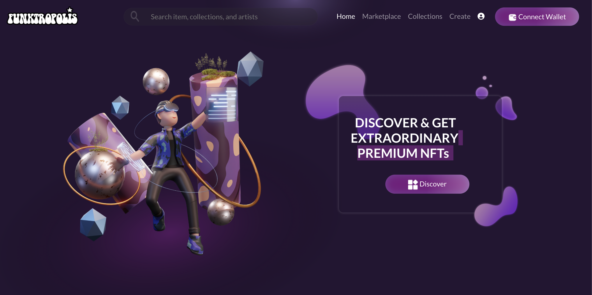

# Funktropolis

Welcome to **Funktropolis**! This is a React application with a beautiful design implemented using SCSS. The project showcases modern web development practices with a focus on a stylish and responsive user interface.

 

## 🚀 Features

- **React**: Built with React for a modular and scalable architecture.
- **SCSS**: Custom styles using SCSS for a clean and maintainable design.
- **Responsive Design**: Fully responsive layout that works on all devices.
- **Modern UI/UX**: Focus on user experience with sleek animations and interactions.

## 🛠️ Installation

To run this project locally, follow these steps:

1. **Clone the repository**:

   ```bash
   git clone https://github.com/HafizAbdullahUmar/Funktropolis-App.git
   cd Funktropolis-App
   ```

2. **Install dependencies**:

   Make sure you have Node.js installed, then run:

   ```bash
   npm install
   ```

3. **Start the development server**:

   ```bash
   npm start
   ```

## 📁 Project Structure

- **src/**: Contains all the source code.
  - **components/**: Reusable components used throughout the app.
  - **styles/**: SCSS files for styling.
  - **assets/**: Images and other static assets.
- **public/**: Publicly accessible files, including the `index.html`.


## 📝 License

This project is licensed under the MIT License. See the [LICENSE](LICENSE) file for details.

## 🙌 Contributions

Contributions are welcome! If you have ideas, suggestions, or bug reports, feel free to open an issue or submit a pull request.

## 📬 Contact

For any inquiries or feedback, reach out to me at [abdullahotrtks@gmail.com](mailto:abdullahotrtks@gmail.com).

---

Made with ❤️ by [Abdullah](https://github.com/HafizAbdullahUmar)

**Disclaimer**: The design used in this project was provided by AMMAG Technologies during my internship. All design rights are owned by AMMAG Technologies. The code is my original work and is licensed under the [MIT License](LICENSE).
